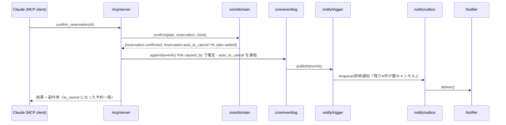

# plancel Design

> Source: `docs/SDD.md` (2026-07-04) / requirements.md 対応。TypeScript + Deno。デプロイ第一候補 Deno Deploy + Deno KV、第二候補 VPS + SQLite（Store 抽象で後決め）。

## Overview

三層分離（core / adapter / MCP）。全入口は「テキスト or 画像 → 正規化 → 共通 Zod スキーマ」の1本に集約する。非決定性の源（時刻・外部送信・LLM）は Clock / Notifier+Outbox / Parser の各 interface の背後に隔離し、コアロジックは純粋関数として決定的にテストする。状態は追記型ドメインイベントログを一次情報とし、KV 上の現在値は導出キャッシュと位置づける。

## Architecture

### Components

- **core/schema**: 全エンティティの Zod スキーマ（単一ソース）。MCP ツール入力・パーサー出力・Store の検証を全てここに集約。 [FR-001, FR-003]
- **core/domain**: 状態遷移・quota 判定・policy 境界計算の純粋関数群。`(state, command, clock) → DomainEvent[]`。I/O なし。 [FR-002, US-002]
- **core/eventlog**: DomainEvent の追記と畳み込み（イベント → 現在状態の再構築）。caused_by / correlation_id 管理。 [FR-009]
- **core/store**: `Store` interface。実装は `KvStore`（Deno KV）/ `SqliteStore`。 [FR-012]
- **core/clock**: `Clock` interface（`now(): Temporal.Instant`）。`SystemClock` / `VirtualClock`。lint ルールで `Date.now()`/`new Date()` 直呼び禁止。 [FR-008]
- **notify/trigger**: 発火判定の純粋関数 `computePendingNotifications(reservations, clock) → PendingNotification[]`。イベントログ購読 + cron tick から呼ばれる。 [FR-005, US-003]
- **notify/outbox**: 冪等キー `reservation_id + trigger種別 + 境界時刻` で消込管理。失敗リトライ。 [FR-005]
- **notify/notifier**: `Notifier` interface。`ConsoleNotifier` → `LineNotifier` → `EmailNotifier(Resend)` の順に実装。 [FR-006]
- **mcp/server**: ツール定義 11 本 + debug ツール群（環境フラグ）。スキーマ化された読み書き口に徹し、パース知能を持たない。 [FR-007, US-004]
- **parse/pipeline**: `Parser` interface + 設定ファイル宣言のチェーン。バリデーション駆動フォールバック。`MockParser` / リプレイハーネス。 [FR-011, US-006]
- **line/bot**: LINE webhook 受信 → parse/pipeline → Quick Reply 差し戻し。通知チャネルと同一 Bot。 [US-006]
- **cron**: 15分間隔 tick。「Clock を読んで発火判定を呼び Outbox に積む」だけの薄い層。 [NFR]

### Data Flow

#### 確定 → 自動 to_cancel → 通知（コア動作）



#### cron による境界通知

```
Deno.cron (15分) → clock.now() → computePendingNotifications(全予約, clock)
  → Outbox.enqueue(冪等キーで重複排除) → Notifier.deliver（失敗はリトライ）
```

#### パースパイプライン（MVP-2）

```
入力 → 経路判定
  画像   → GeminiFlashParser (vision固定)
  テキスト → GroqParser → (fail) → GeminiFlashParser
      ↓ 各段で PII マスク前処理 → LLM → Zod バリデーション
  通過 → 登録 / 全段失敗 → ParseJob(needs_review) → 欠損のみ質問
  複数段出力の食い違い → FieldConflict → Quick Reply ワンタップ選択
```

## Data Models

SDD §3 の 6 エンティティ（Event / Plan / Reservation / CancellationPolicy / PolicyTemplate / ParseJob）+ §10.2 DomainEvent をそのまま採用。追加の内部モデル:

```typescript
interface PendingNotification {
  idempotency_key: string;   // reservation_id + trigger + 境界時刻
  trigger: "fee_boundary_24h" | "plan_settled" | "policy_unknown_digest" | "day_of_reminder";
  reservation_id: string;
  fire_at: string;           // ISO datetime
  message: string;           // 損失額を含む本文
}

interface OutboxEntry extends PendingNotification {
  status: "pending" | "delivered" | "failed";
  attempts: number;
  delivered_at: string | null;
}

interface Clock { now(): Temporal.Instant; }
interface Notifier { deliver(n: PendingNotification): Promise<void>; }
interface Parser { parse(input: ParseInput): Promise<ParseAttempt>; }
interface Store { /* get/set/list per entity + event append/scan */ }
```

### KV キー設計（リレーショナル写像可能な形）

```
event/<ulid>                 plan/<ulid>              reservation/<ulid>
domain_event/<ulid>          outbox/<idempotency_key>
policy_template/<service_key> parse_job/<ulid>
idx/plan_reservations/<plan_id>/<res_id>   idx/pending_cancel/<starts_at>/<res_id>
```

## API Design（MCP ツール）

| Tool | 入力（要点） | 出力（要点） |
|---|---|---|
| `create_event` | title, date_range?, notes? | Event |
| `create_reservation` | Reservation 構造化入力（policy は unknown 可） | Reservation |
| `create_plan` | title, date_range?, confirm_quota=1 | Plan |
| `add_to_plan` | plan_id, reservation_id \| reservation入力 | Plan + Reservation |
| `confirm_reservation` | reservation_id | 確定結果 + **副作用: to_cancel 遷移した予約一覧** |
| `report_cancelled` | reservation_id | 更新後 Reservation |
| `void_reservation` | reservation_id, reason? | voided イベント追記結果 |
| `set_policy` | reservation_id, policy | policy.provided イベント追記結果 |
| `list_pending_cancellations` | — | to_cancel 一覧（期限順・損失額付き） |
| `get_plan` / `get_event` | id | 構成要素と状態集計 |
| `debug_*`（フラグ時のみ） | dump_state / advance_clock / preview_notifications / replay_parse | — |

## Error Handling

- **Zod 検証失敗（MCP/パーサー）**: 欠損・違反フィールドを列挙して返す。登録しない。
- **starts_at が過去**: 拒否せず警告付き確認を要求。
- **policy 不整合**（offset 非降順 / fee 非単調）: 登録拒否＋理由提示。`"unknown"` は許容。
- **quota 到達済み Plan への confirm**: 拒否（settled 状態エラー）。
- **通知配送失敗**: Outbox でリトライ（attempts 記録）。冪等キーで二重送信防止。
- **パース全段失敗**: ParseJob を `needs_review` 化。欠損フィールドのみ質問、全文再入力は要求しない。
- **不正な状態遷移**: domain 層で遷移表に照らして拒否（例: cancelled → confirmed）。

## Security Considerations

- 外部 LLM 送信前の PII マスク（電話番号・メールアドレス）を parse/pipeline の必須前処理とする。
- debug MCP ツールは環境フラグで本番無効化。
- LINE webhook は署名検証（channel secret）。利用者は本人＋身内のみ（LINE userId 許可リスト）。
- 物理削除なし（追記型）のため、誤操作によるデータ喪失リスクを構造的に排除。

## Testing Strategy

- **Unit**: core/domain の純粋関数（状態遷移・quota・policy 境界計算）を VirtualClock で決定的にテスト。発火判定関数を直接叩く（cron 経由にしない）。
- **Integration**: eventlog 畳み込み ↔ Store（KV/SQLite 両実装）、Outbox 冪等性、MCP ツール入出力（in-memory Store）。
- **Replay/回帰**: 記録済み ParseJob フィクスチャの再実行ハーネス。プロンプト・チェーン変更のたびに実行。
- **E2E シナリオ**: シードフィクスチャ投入 → confirm → auto_to_cancel → VirtualClock を3日進める → previewNotifications で通知列挙、を1コマンドで再現。
- MVP-1 の全テストは外部サービス接続ゼロで完結すること。

## Implementation Order（依存レイヤー）

L0（schema+Clock+Store+EventLog）→ L1（domain 純粋関数）→ **L2a（通知）/ L2b（MCP）/ L4（パーサー・MockLLM）は相互独立・並行可** → L3（cron ← L2a）→ L5（LINE + 実LLM ← L2a, L4）。MVP-1 = L0〜L3。

## Out of Scope（v1.x 以降）

メール転送パース / ics カレンダー連携 / ブックマークレット / 汎用 update / 物理 delete。フェーズ2: Web 拡張・Gmail 直読・有料 LLM・公開。

## Requirements Coverage

US-001〜005 / FR-001〜010, 012, 013 → MVP-1（L0〜L3）。US-006 / FR-011 → MVP-2（L4〜L5）。全 US/FR が上記コンポーネントに対応（各所に [参照] 記載）。
